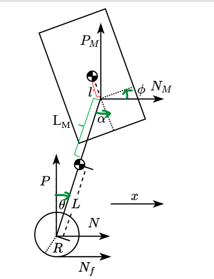

# Naixiang(Gabriel) Gao Development Log
1. [Motor Selection](#MotorSelection)
2. [Establish Physical Model](#PhysicalModel)

# Motor Selection 
## Wheel Motors
1. **Better for direct drive motor(withour gearbox).**
2. **Output torque should be approximately linear and be stable at the low speed.**
3. **Accept high power input.**

The reason is that we want to use this motor as a "torque controller", which can decrease the complexity of the whole model. Gaps between the gear sets may affect the efficiency of the torque output and the accuracy of the returned data. Also, we don't want the output unstable, resulting in oscillating or even disrupted equilibrium states. 

## Leg Motors
1. **Stable data communication at high voltage or high power.**
2. **Excellent heat dissipation.**
3. **The peak of output torque $\ge 20 N\cdot m$**

The reason is that we want the motor can receive and send the data or signal when we have instantaneous large torque. The instantaneous large torque will lead the instantaneous large power, which might interfere with the data signal. When we use the motor to output a large torque, we need to ensure its excellent heat dissipation to avoid burn it. When the robot is descending stairs, we need to have enough torque to counter the falling momentum of the robot.

# Establish Physical Model 
## Abstract Model Image

### Variable and Parameter Declaration 

|**Variables** |                                                             |            |  
|---           |---                                                          |---         |
|**Label**     |**Meanning**                                                 |**Unit**    |
|$x$           |The displacement of the wheel                                |$m$         |  
|$\theta$      |The angle between rod and the wheel                          |$rad$       |
|$\phi$        |The angle between the body and the horizontal axis           |$rad$       |
|$\alpha$      |The angle between the body and the vertical axis             |$rad        |
|$T$           |The output torque of the wheel motors                        |$N\cdot m$  |
|$T_p$         |The output torque of the leg motors                          |$N\cdot m$  |
|$N$           |The horizontal component of the force from wheel to the rod  |$N$         |
|$N_M$         |The horizontal component of the force from rod to the body   |$N$         |
|$P$           |The vertical component of the force from wheel to the rod    |$N$         |
|$P_M$         |The vertical component of the force from rod to the body     |$N$         |
|$N_f$         |The friction of the wheel when moving                        |$N$         |

|**Parameters**|                                                                                      |                |  
|---           |---                                                                                   |---             |
|**Label**     |**Meanning**                                                                          |**Unit**        |
|$R$           |The radius of the wheel                                                               |$m$             |  
|$L$           |The distance between rod's center of gravity and the rotation axis of the wheel motor |$m$             |
|$L_m$         |The distance between rod's center of gravity and the rotation axis of the leg motor   |$m$             |
|$l$           |The distance between body's center of gravity and the rotation axis of the leg motor  |$m$             |
|$m_w$         |The mass of rotor in the wheel motors                                                 |$kg$            |
|$m_p$         |The mass of the rod                                                                   |$kg$            |
|$M$           |The mass of the body                                                                  |$kg$            |
|$I_w$         |The moment of inertia of rotor in the wheel motors                                    |$kg\cdot m^2$   |
|$I_p$         |The moment of inertia of the rod rotated around the center of mass                    |$kg\cdot m^2$   |
|$I_M$         |The moment of inertia of the body rotated around the center of mass                   |$kg\cdot m^2$   |