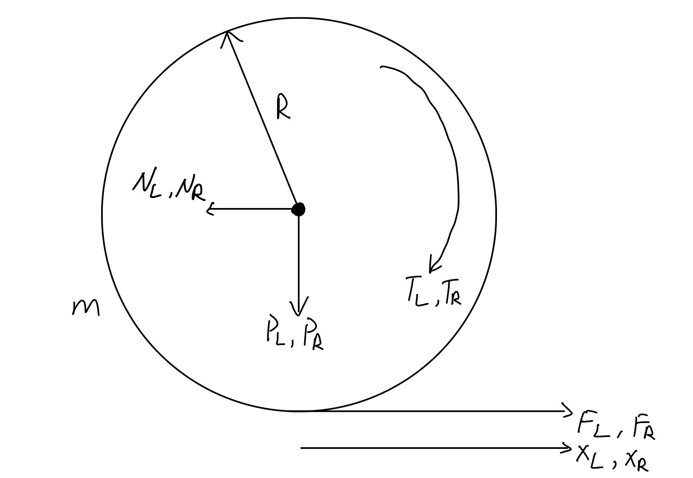

# Naixiang(Gabriel) Gao Development Log
1. [Motor Selection](#motor-selection)
2. [Establish Physical Model](#establish-physical-model)
3. [Reference](#reference)

# Motor Selection
## Wheel Motors
1. **Better for direct drive motor(withour gearbox).**
2. **Output torque should be approximately linear and be stable at the low speed.**
3. **Accept high power input.**

The reason is that we want to use this motor as a "torque controller", which can decrease the complexity of the whole model. Gaps between the gear sets may affect the efficiency of the torque output and the accuracy of the returned data. Also, we don't want the output unstable, resulting in oscillating or even disrupted equilibrium states. 

## Leg Motors
1. **Stable data communication at high voltage or high power.**
2. **Excellent heat dissipation.**
3. **The peak of output torque $\ge 20 N\cdot m$**

The reason is that we want the motor can receive and send the data or signal when we have instantaneous large torque. The instantaneous large torque will lead the instantaneous large power, which might interfere with the data signal. When we use the motor to output a large torque, we need to ensure its excellent heat dissipation to avoid burn it. When the robot is descending stairs, we need to have enough torque to counter the falling momentum of the robot.

# Establish Physical Model
## Assumption
To simplify the model of the wheeled-legged robot, we can split the complex motion into wheel motion and leg motion. Wheel motion should include planar motion(balance in stationary state, and move forward and backward) and rotation motion. Leg motion include height adjustment and jumping. 

## Variable and Parameter Declaration 

|**Variables** |                                                                                            |            |  
|---           |---                                                                                         |---         |
|**Label**     |**Meaning**                                                                                 |**Unit**    |
|$x_L, x_R$    |The displacement of the left and right wheels                                               |$m$         |  
|$y$           |The distance between the body's center of mass and wheel motor rotation axis along y axis   |$m$         |
|$\phi$        |The roll angle of the body                                                                  |$rad$       |  
|$\theta$      |The pitch angle of the body                                                                 |$rad$       |
|$\psi$        |The yaw angle of the body                                                                   |$rad$       |
|$T_L, T_R$    |The output torque of the left and right wheel motors                                        |$N\cdot m$  |
|$T$           |The output torque of the leg motors                                                         |$N\cdot m$  |
|$N_L, N_R$    |The horizontal component of the force between wheels and the body (along x axis)            |$N$         |
|$P_L, P_R$    |The vertical component of the force between wheels and the body (along y axis)              |$N$         |
|$F_L, F_R$    |Th e frictions of the wheels when moving                                                    |$N$         |

|**Parameters**|                                                                                      |                |  
|---           |---                                                                                   |---             |
|**Label**     |**Meaning**                                                                           |**Unit**        |
|$m$         |The mass of rotor in the wheel motors                                                 |$kg$            |
|$M$           |The mass of the body                                                                  |$kg$            |
|$I_w$         |The moment of inertia of rotor in the wheel motors                                    |$kg\cdot m^2$   |
|$I_x$         |The moment of inertia of the body rotated around the x axis                           |$kg\cdot m^2$   |
|$I_y$         |The moment of inertia of the body rotated around the y axis                           |$kg\cdot m^2$   |
|$I_y$         |The moment of inertia of the body rotated around the z axis                           |$kg\cdot m^2$   |
|$R$           |The radius of the wheel                                                               |$m$             |  
|$L$           |The distance between body's center of mass and the rotation axis of the wheel motor   |$m$             |
|$D$           |The distance between left and right wheels                                            |$m$             |
|$g$           |The acceleration due to the gravity measured                                          |$m/s^2$         |

## Classical Mechanical Analysis for Wheel Motion
(**NOTE:** If you use the Lagrange equation, you can get the same equations in the below part)

### Assumption
1. The mass of the body can be represented at the center of the mass.
2. Ignore the mass of led linkage and the effect on wheel motion from leg movement.
3. No sliding on the wheels.

### Planar Motion Analysis 
***Simplified Planar Motion Model***

**Move Forward and Backward**

**For the net force:**

Because we suppose the rotation for the left and right wheel motors is almost the same, we will use left wheel motor to do the calculation.

$$
\begin{align}
F_{net} &= ma \\
F_L - N_L &= m \ddot{x_L}  \tag{1}
\end{align}
$$

**For the net torque:**
**According to transformation between rotation and linear motion**

$$
\begin{align}
\Tau &= I\alpha \\
T_L - F_L * R &= I_w \frac{\ddot{x_L}}{R} \tag{2}
\end{align}
$$

**Combine equation (1) and (2), we can eliminate $F_L$**

According (1):

$$
\begin{align}
F_L = m \ddot{x_L} + N_L 
\end{align}
$$

Plug (3) into (2):

$$
\begin{align}
T_L - (m \ddot{x_L} + N_L)* R &= I_w \frac{\ddot{x_L}}{R}\\
T_L - N_LR - mR\ddot{x_L} &= I_w \frac{\ddot{x_L}}{R}\\
(\frac{I_w}{R} + m R)\ddot{x_L} &= T_L - N_LR\\
\ddot{x_L} &= \frac{T_L - N_LR}{\frac{I_w}{R} + m R} 
\end{align}
$$

### Rod Force Analysis

### Body Force Analysis

# Reference

