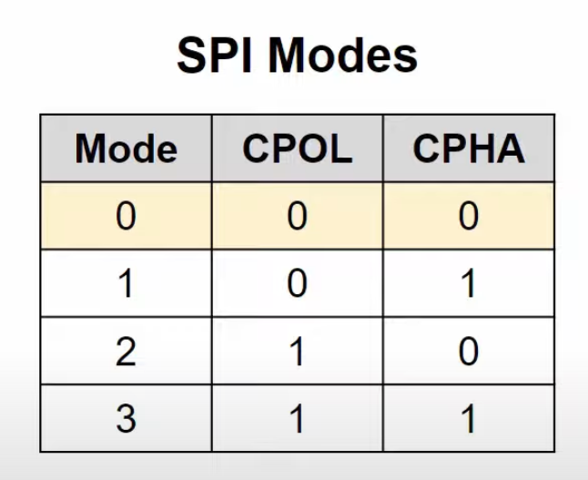
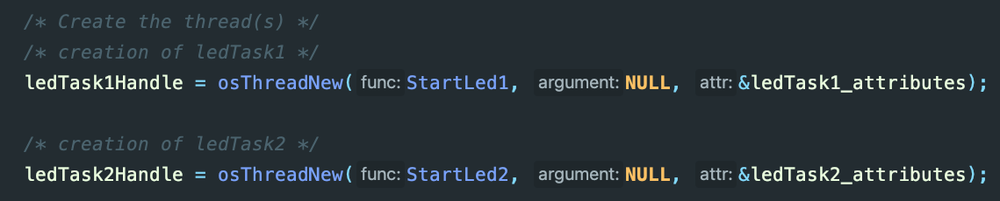

# Runxuan(Jerry) Wang Development Log

# Review on SPI
SPI is not an official standard, thus it has many variations. 

Chip select is active low. Pull CS to low to begin transmission.

**Two types of SCK (different clock polarities):**
* CPOL  = 0: idles low
* CPOL = 1: idles high

**Two types of Clock phase (CPHA)**
* CPHA = 0: bits on MOSI or MISO should be sampled on the leading edge of the clock pulse (rising edge if CPOL=0, falling edge if CPOL=1)
* CPHA = 1: bits sampled on the trailing edge

In most cases, CPOL = 0 and CPHA = 0

Example:

# PCB Design - Preliminary
<!--  -->

Our development board is based on a STM32F103C8T6 chip. The board uses a CAN bus, two USARTs, an SPI, a I2C, and a USB. 

## Microcontroller
The NRST or inverted reset pin is active low, meaning that the program runs on the chip when it is pulled to high. The pin is connected to a push button, allowing the pin to stay high unless the button is pushed. The boot pin allows us to program the microcontroller using interfaces such as uart, i2c, and usb when the pin is pulled to high. The switch connected to the pin allows us to choose whether we want to program it this way or using JTAG/SWD. The PD0 and PD1 are connected to a 16 MHz external crystal oscillator, which is connected in a circuitry consisting of two 10 pF load capacitors. 

## Power Supply
We are using an AMS1117 linear regulator to provide stable 3.3V to the microcontroller. Two 22uF decoupling capacitors are necessary for the regulator to work. I've also added and LED to indicate the power output.

## CAN Transceiver
The MAX3051 CAN Transceiver is a vital part of the circuit because we need to translate the logic signal of the CAN controller to the differential signal of the CAN bus. Without this device we cannot communicate with other devices using CAN bus.

## IMU
The BMI088 Inertial Measurement Unit is necessary to determine the current state of the robot. On our development board, we are using SPI as it is faster that I2C. The SCK, MOSI, and MISO signals are wired to the SPI interface of the microcontroller. The chip select signal is separate for the accelerometer and the gyroscope - each signal is wired to a GPIO pin defined on the microcontroller. The IMU exmploys an interrupt based transmission, which is why the interupt lines are necessary for the accelerometer and the gyroscope. The INT1_ACC and INT1_GYR are connected to two other defined GPIO pins set to interrupt mode.

## DBUS/SBUS Inverter
The DBUS/SBUS inverter is necessary because the protocol uses an inverted UART signal. Normally, a UART module interprets a high voltage as a logical 1 and a low voltage as a logical 0. However, DBUS/SBUS interprets a low voltage as a logical 1 and a high voltage as a logical 0.

# STM32 Pin Assignment

The pinout was configured in STM32CubeIDE as shown below.

## GPIO
Currently, we have four defined GPIO pins that all connects to the BMI088 IMU. INT1_ACCEL and INT1_GYRO are the interrupt lines for the accelerometer and the gyroscope. Both are defaulted to pull-up and operate in external interrupt GPIO mode with rising edge trigger detection. CS1_ACCEL and CS1_GYRO are the chip select for the accelerometer and the gyroscope. Both are defaulted to pull-up and operate in output push-pull GPIO mode. Another GPIO might be added later as a user defined push button.

## CAN
The CAN_TX operates in alternate function push pull GPIO mode, and the CAN_RX operates in input mode withou GPIO pull-up or pull-down (double check).

## I2C
Both I2C1_SCL and I2C1_SDA operate in alternate function open drain GPIO mode with maximum output speed set to high.

## SPI
The SPI bus operates in full-duplex master mode. The frame format is Motorla with a data size of 8 bits, MSB first. The baud rate is currently set to 4.0 MBits/s (BMI088 has a max operating frequency of 10 Hz). CPOL is set to high and CPHA is set to 2 edge (check). The SPI1_MISO operates in input GPIO mode with no pull-up or pull-down (double check). Both SPI1_CLK and SPI1_MOSI operates in alternate function push pull GPIO mode.

## USART
Both USART are set to asynchronous mode, with a baud rate of 115200, word length 8 bits, no parity, and 1 stop bit. The USART1_TX and USART2_TX operate in alternate function push pull GPIO mode. The USART1_RX and USART2_RX operate in input GPIO mode with not pull-up or pull-down (double check).

(check TIM)

### TODOS:
* Check details with DJI TypeC Board
* Add push button

# Progress update (October 6)

The entire schematics is transferred to JLC EDA as its library is more complete and the stock of each component is visable. The connectors are separated into a different page for clarity.

The initial PCB layout without routing is below.

TODOs:
* Add reverse-polarity protection?
* Add test points (especially each signal of the IMU because of its BGA package)
* Add gaps around the IMU to insulate it
* Check if UART and SWD need extra circuits
* confirm LED color
* check diode connection
* check via across CAN

Two GPIO LEDs are added and both are active low (the two corresponding pins are internal pull-up, meaning that outputing 0 lights up the LEDs). One GPIO button is added and it's also active low (the pin is internal pull-up, meaning that pushing the button gives 0)

Before placing each component, it's a good idea to look at the chip assignment in STM32CubeIDE to determine the placement of each section. For example, if the IMU signals are on the left of the chip, we should place the IMU at the left of the chip so the wires don't need to go all the way across the board.

# Progress update (October 13)

The PCB routing is finished. It's quite challenging to layout all components and their wires in a two layer board. There are several design considerations when I was laying out the board. One thing is that I group the power circuit to one part (bottom right corner) of the circuit so it is not spread aross the entire board and make routing difficult. 

I placed the IMU in an isolated area (top left corner) to minimize it being affected by the heat from other circuits. The IMU is a MEMS (micro-electromechanical system) device, which contains tiny mechanical components that determine its angular velocity and acceleration. This means that a change in temperature can affect the device due to the expansion/contraction of the small mechanical structures, causing inaccurate measurements. I've seen several other board designs that insulates the IMU. For example, one design provides padding below the IMU so its further away from the board; another design carves out the board surrounding the IMU, with thin bridges holding it in place; a more impressive design employs a heater circuit to heat the IMU to a constant temperature. Considering that this is my first board design, I decided to keep in simple, but I might try some of these designs for the next generation. 

The figure above shows the final design of the board. This board will work with another power board designed by Tony. The power board can convert the battery voltage from 24V to 5V and 3.3V, which are supplied to my board through two giant xt30 plugs in the center. The power board can stack onto my development board seamlessly. The reason behind this design is that we want to isolate the development board from high voltage and protect it from a short circuit. Even so, my board is still functional on itself by powering it though the USB Type-C plug, meaning that I can test the board easily without the need of connecting it to a battery.

By this time the board is purchased from Pcbway. To get the components for the two boards, I first went through the BOM (Bill of Materials) of each board and check if any components are available in the electronics service shop. Those that are not available will be purchased from DigiKey. Going through all components is an exhausting process, especially when many components we chose have different names than the JLC shop. It is also important to make sure that the components have the same footprint or package from the ones in the design.

The above figure shows the BOM of the two boards. The ones in bold are available in the electronics service shop. Those in red are available from DigiKey and the ones in orange are from other sources. 

# Progress update (October 20)

The plan for this week is to use a STM32F1 Nucleo board to test some basic functionalities while waiting for the boards and components to arrive. I configure the Nucleo board and tested a simple LED program. The next step is to configure our own environment and make sure the code works there as well.

ARM developed the Cortex Microcontroller Software Interface Standard (CMSIS) that provides a programming interface to ARM Cortex-M microcontrollers. The Hardware Abstraction Layer (HAL) provides a high-level API that allows easier access to the hardware layer. In our case, the HAL is provided by the chip manufacturer, STMicroelectronics. 

We can write a simple LED flashing program by pulling the gpio pin corresponding to the LED high or low with a time interval between. This can be written in the main for loop in main.c. However, for more complicated application, we need a Real Time Operating System (RTOS). This allows us to create multiple threads on a single core, where the RTOS's scheduler is responsible for switching tasks, scheduling, etc. The RTOS kernel we are using is FreeRTOS, a very popular open source RTOS kernel. However, we are not directly using the APIs from FreeRTOS. Instead, we are using the CMSIS-RTOS library developed by ARM, which acts as an abstraction layer to FreeRTOS, as shown in the figure above. Different to FreeRTOS, CMSIS-RTOS refers to each job as thread instead of task. I will use these two terms interchangeably.

The CMSIS-RTOS v2 API can be found here: https://www.keil.com/pack/doc/CMSIS/RTOS2/html/group__CMSIS__RTOS.html

We can define and create the threads as shown below, where we specify their attributes such as name, stack size, and priority. 

The priority is an attribute that we can use to specify the importance of each task. A task with higher priority can preempt a task with lower priority. For example, our task that controls the chassis motor need to respond quickly to stabilize the motor, meaning that it definitely needs a higher priority than a LED blinking task. 

# Progress update (October 27)

Building and running the LED examples in the STM32CubeIDE was working. In this week, I was working on building our own environment so we can compile our programs using Make. I encountered a lot of issues when writing our CMakeList, such as not linking library files correctly. Our PCB parts will likely arrive next week and I will work on soldering our boards. 

## Notes on CMakeList
target_link_libraries(${PROJECT_NAME}_interface INTERFACE board_interface)

${PROJECT_NAME}_interface: This is the target you're specifying libraries (or other targets) for.
INTERFACE: This is a keyword that specifies the "link type". In CMake, you have three primary keywords for this purpose:
PRIVATE: This means the linked libraries/targets are used by this target and are not propagated to targets that link to this target.
PUBLIC: This means the linked libraries/targets are used by this target and are propagated to targets that link to this target.
INTERFACE: This means the linked libraries/targets are not used by this target itself but are propagated to any targets that link to this target.
board_interface: This is the library or target you're linking against.

When you link another target (let's call it some_target) to ${PROJECT_NAME}_interface, that some_target will also inherit the link dependency on board_interface, even though ${PROJECT_NAME}_interface itself doesn't directly link against board_interface.

This is useful for header-only libraries or when you want to propagate compile definitions, compile options, or include directories without actually linking a library.

So, essentially, this command sets up a transitive relationship: anything that links to ${PROJECT_NAME}_interface will also need to consider board_interface, but ${PROJECT_NAME}_interface itself doesn't directly utilize board_interface for its own build/linking process.

## Bug log
- compilation error due to not adding the new board's library in the "shared" directory's CMakeList
- compilation error due to core library files such as can.h, spi.h, and usart.h are not found. Solved by ticking the "generate peripheral initialization as a pair of '.c/.h' files per peripheral" option in CubeMX.
- compilation error due to arm_math.h not found. This is because the DSP library is not added to the project
- millions of compilation error due to ARM_MATH_CM3 not added in the compile definitions
- compilation error of usbd_cdc.h and dma.h not found. Solved by adding usb in board CMakeList and turning on dma for spi
- /Users/jerrywang/Documents/iRM_Embedded_2023_2/shared/bsp/bsp_can.cc:71:57: error:'HAL_CAN_RX_FIFO0_MSG_PENDING_CB_ID' was not declared in this scope; did you mean 'CAN_IT_RX_FIFO0_MSG_PENDING'?

# Progress update (November 3)
