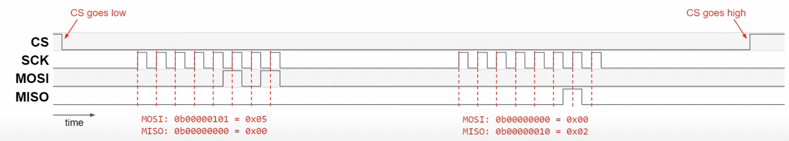

# Runxuan(Jerry) Wang Development Log

# Review on SPI
SPI is not an official standard, thus it has many variations. 

Chip select is active low. Pull CS to low to begin transmission.

**Two types of SCK (different clock polarities):**
* CPOL  = 0: idles low
* CPOL = 1: idles high

**Two types of Clock phase (CPHA)**
* CPHA = 0: bits on MOSI or MISO should be sampled on the leading edge of the clock pulse (rising edge if CPOL=0, falling edge if CPOL=1)
* CPHA = 1: bits sampled on the trailing edge

In most cases, CPOL = 0 and CPHA = 0

Example:

# PCB Design - Preliminary
<!--  -->

Our development board is based on a STM32F103C8T6 chip. The board uses a CAN bus, two USARTs, an SPI, a I2C, and a USB. 

## Microcontroller
The NRST or inverted reset pin is active low, meaning that the program runs on the chip when it is pulled to high. The pin is connected to a push button, allowing the pin to stay high unless the button is pushed. The boot pin allows us to program the microcontroller using interfaces such as uart, i2c, and usb when the pin is pulled to high. The switch connected to the pin allows us to choose whether we want to program it this way or using JTAG/SWD. The PD0 and PD1 are connected to a 16 MHz external crystal oscillator, which is connected in a circuitry consisting of two 10 pF load capacitors. 

## Power Supply
We are using an AMS1117 linear regulator to provide stable 3.3V to the microcontroller. Two 22uF decoupling capacitors are necessary for the regulator to work. I've also added and LED to indicate the power output.

## CAN Transceiver
The MAX3051 CAN Transceiver is a vital part of the circuit because we need to translate the logic signal of the CAN controller to the differential signal of the CAN bus. Without this device we cannot communicate with other devices using CAN bus.

## IMU
The BMI088 Inertial Measurement Unit is necessary to determine the current state of the robot. On our development board, we are using SPI as it is faster that I2C. The SCK, MOSI, and MISO signals are wired to the SPI interface of the microcontroller. The chip select signal is separate for the accelerometer and the gyroscope - each signal is wired to a GPIO pin defined on the microcontroller. The IMU exmploys an interrupt based transmission, which is why the interupt lines are necessary for the accelerometer and the gyroscope. The INT1_ACC and INT1_GYR are connected to two other defined GPIO pins set to interrupt mode.

## DBUS/SBUS Inverter
The DBUS/SBUS inverter is necessary because the protocol uses an inverted UART signal. Normally, a UART module interprets a high voltage as a logical 1 and a low voltage as a logical 0. However, DBUS/SBUS interprets a low voltage as a logical 1 and a high voltage as a logical 0.

# STM32 Pin Assignment

The pinout was configured in STM32CubeIDE as shown below.

## GPIO
Currently, we have four defined GPIO pins that all connects to the BMI088 IMU. INT1_ACCEL and INT1_GYRO are the interrupt lines for the accelerometer and the gyroscope. Both are defaulted to pull-up and operate in external interrupt GPIO mode with rising edge trigger detection. CS1_ACCEL and CS1_GYRO are the chip select for the accelerometer and the gyroscope. Both are defaulted to pull-up and operate in output push-pull GPIO mode. Another GPIO might be added later as a user defined push button.

## CAN
The CAN_TX operates in alternate function push pull GPIO mode, and the CAN_RX operates in input mode withou GPIO pull-up or pull-down (double check).

## I2C
Both I2C1_SCL and I2C1_SDA operate in alternate function open drain GPIO mode with maximum output speed set to high.

## SPI
The SPI bus operates in full-duplex master mode. The frame format is Motorla with a data size of 8 bits, MSB first. The baud rate is currently set to 4.0 MBits/s (BMI088 has a max operating frequency of 10 Hz). CPOL is set to high and CPHA is set to 2 edge (check). The SPI1_MISO operates in input GPIO mode with no pull-up or pull-down (double check). Both SPI1_CLK and SPI1_MOSI operates in alternate function push pull GPIO mode.

## USART
Both USART are set to asynchronous mode, with a baud rate of 115200, word length 8 bits, no parity, and 1 stop bit. The USART1_TX and USART2_TX operate in alternate function push pull GPIO mode. The USART1_RX and USART2_RX operate in input GPIO mode with not pull-up or pull-down (double check).

(check TIM)

### TODOS:
* Check details with DJI TypeC Board
* Add push button
